

    
    <h1 style="margin-left: 20px;">모바일 스키 강습 플랫폼 GOSKI</h1>

## 목차

1. [**서비스 소개**](#1)
2. [**주요기능 소개**](#2)
3. [**기술 스택**](#3)
4. [**시스템 아키텍처**](#4)
5. [**팀원 소개**](#5)
6. [**프로젝트 일정**](#6)
7. [**참고**](#7)

## 💡 서비스 소개

### 검증된 개인 맞춤형 스키/보드 강습
스키장에 처음왔는데 어떤 강습을 받아야할지 모른다면?  
GOSKI에서 검증받은 강사 분들께 맞춤 강습을 받을 수 있습니다!  
강습 이후에는 강사 분들로부터 받은 피드백을 통해 실력을 향상 시킬 수 있어요.

### 효율적인 강습 팀과 강습 스케줄 관리
GOSKI와 함께라면팀 단위 및 개인 단위 스케줄을 최적으로 분배할 수 있습니다.  
보다 쉽고 간편하게 강습 스케줄을 관리해보세요! 

## 🖥️ 주요 기능 소개

### 수강생

#### 로그인 / 리조트 선택
 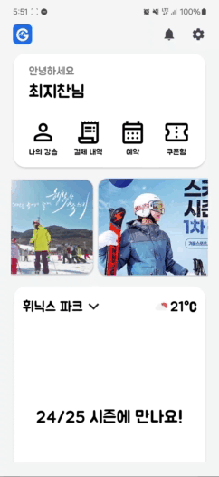

#### 강습내역
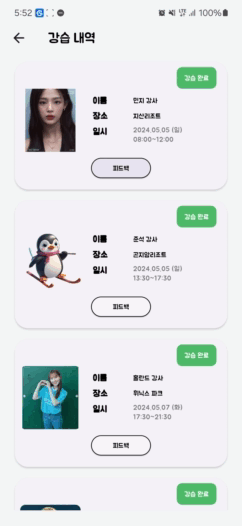

#### 피드백 / 리뷰

 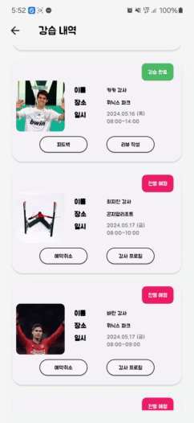

#### 강사 프로필
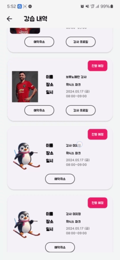

#### 강습 예약 / 강습 취소
 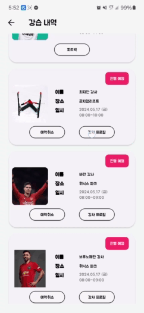

#### 결제 내역
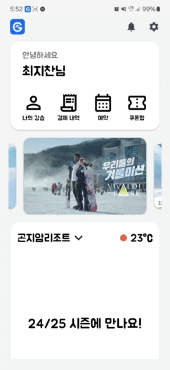

#### 알림 / 실시간 쪽지
 

#### 알림 설정
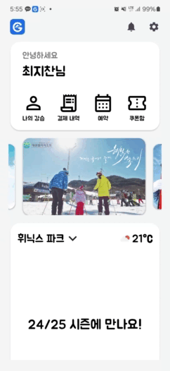

### 강사

#### 로그인 화면

#### 일정 확인 / 실시간 강습 예약
 

#### 알림 
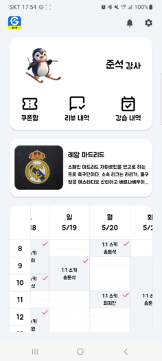  

#### 강습 내역 / 피드백 작성
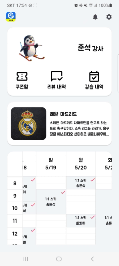 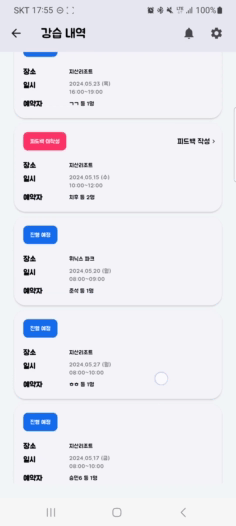

#### 리뷰 내역
  

## 🛠️ 기술 스택
  
 
 
 

 
 

 
    
 
   

<h4>

<b> 상세 기술스택 및 버전 </b> 

| 구분       | 기술스택            | 상세내용               | 버전      |
|----------|-----------------|--------------------|---------|
| 공통       | 형상관리            | Gitlab             | \-      |
|          | 이슈관리            | Jira               | \-      |
|          | 커뮤니케이션          | Mattermost, Notion | \-      |
| BackEnd  | DB              | MariaDB            | 11.3.2  |
|          |                 | JPA                | \-      |
|          |                 | Redis              | 7.2.4   |
|          | Java            | JDK-17             | 17.0.10 |
|          | Spring          | Spring             |         |
|          |                 | Spring Boot        | 3.2.4   |
|          |                 | Spring Security    | \-      |
|          | IDE             | IntelliJ           |         |
|          | Cloud Storage   | AWS S3             | \-      |
|          | Build           | Gradle             | 8.7     |
| FrontEnd | Flutter         |                    | \-      |
|          | DART            |                    | \-      |
|          | Firebase        |                    |         |
| Server   | 서버            | AWS EC2             | \-      |
|          | 플랫폼            | Ubuntu             |         |
|          | 배포              | Docker             |         |
|          | 배포              | Jenkins            |         |

## 🗂️ 시스템 아키텍처
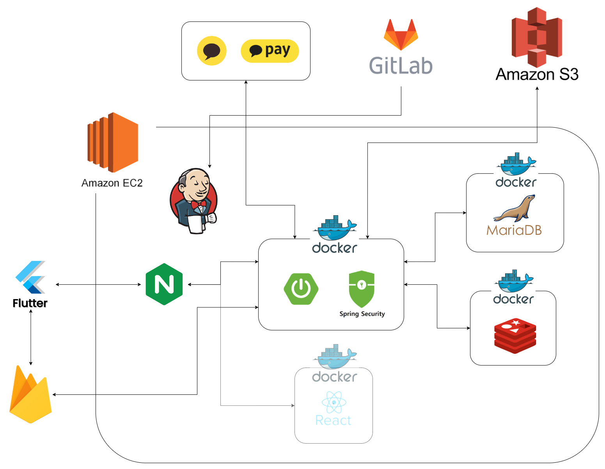

## 👪 팀원 소개

<table>
    <tr>
        <td align="center" width="16%">
               고승민  (Team Leader) </a>  </td>
        <td align="center" width="16%">
               송준석  (Front-End) </a>  </td>
        <td align="center" width="16%">
               최지찬  (Front-End) </a>  </td>
        <td align="center" width="16%">
               고정원  (Back-End) </a>  </td>
        <td align="center" width="16%">
               임종율  (Back-End) </a>  </td>
        <td align="center" width="16%">
               장승호  (Back-End) </a>  </td>
    </tr>
    <tr>
        <td align="center">강습 예약 페이지 UI 결제 페이지 UI 팀 목록 UI 강사 목록 UI 강사/팀 상세페이지 UI
        <td align="center">로그인 페이지 UI  회원가입 페이지 UI   FCM 연동   알림 설정 UI   강사 스케줄 랜더링   스케줄 세부정보 UI
        <td align="center">메인 페이지 UI 강습 내역 UI 결제 내역 UI 피드백 UI  쪽지 UI   리조트 날씨 API 연동
        <td align="center">Infra 회원 관리 API 강습 내역 API  스케줄 API 
        <td align="center">카카오 API 기반 결제 API 사장 정산 및 정산내역 조회 API 강사프로필 및 리조트 조회 API codeF API 기반 계좌 실명 인증 기능
        <td align="center">팀 API   피드백 및 리뷰 API  FCM 알림기능
    </tr>
</table>

## 📆 프로젝트 일정

### 2024.04.08 ~ 2024.05.20

- 기획 및 설계 : 2024.04.08 - 2024.04.13
- 프로젝트 구현 : 2024.04.14 - 2024.05.12
- QA 및 산출물 정리 : 2024.05.13 - 2024.05.20

## 참고
